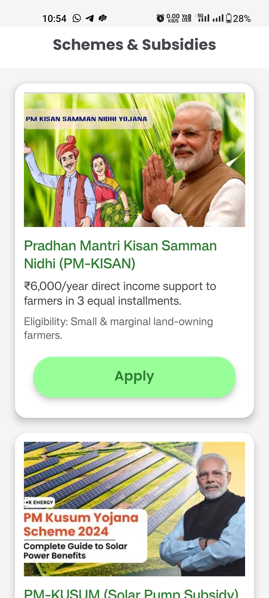
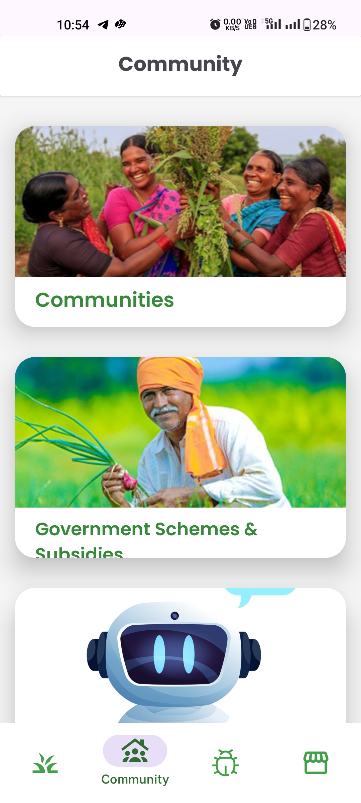
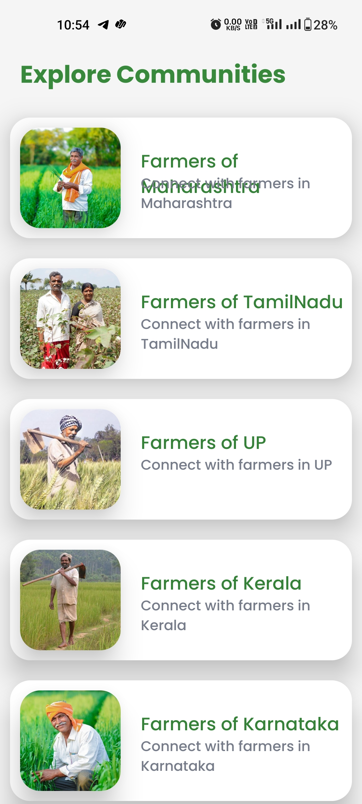
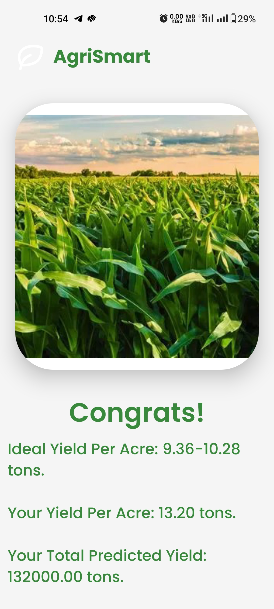

GrowMate – AI-powered Agriculture Platform

GrowMate is an end-to-end platform that empowers farmers and government stakeholders with AI-driven insights. It includes:

- A farmer-focused Android app for crop recommendations, disease and pest detection, irrigation guidance, weather awareness, and yield prediction.
- A modern government web dashboard for statewide monitoring: alerts, pest tracking, market prices, schemes, farmer profiles, reports, and yield analytics.
- A collection of machine learning and remote sensing models powering core intelligence such as crop recommendation, disease/pest detection, yield prediction, and vegetation index analysis (NDVI/NDRE).

---

### Table of Contents

- Overview
- Features
- Architecture
- Machine Learning Models
- Farmer Android App
- Government Web Dashboard
- Datasets and Training
- Local Development
- Project Structure
- Screenshots
- Roadmap
- License

---

## Overview

GrowMate combines on-device and cloud-enabled intelligence to make precision agriculture accessible. The farmer app offers actionable, localized guidance; the government dashboard aggregates signals into a geospatial, district/block-level view to support policy and response.

Core outcomes:

- Data-driven cropping decisions and input usage
- Early detection of crop disease and pest outbreaks
- Optimized irrigation practices
- Yield prediction for planning and logistics
- Administrative visibility for targeted interventions

---

## Features

- Farmer Android app (Java, Android SDK):

  - Multi-language onboarding and authentication (Firebase Auth)
  - Crop recommendation based on soil/weather/region inputs
  - Disease/pest detection from leaf images with recommendations and pesticide guidance
  - Weather, precipitation, and humidity insights with irrigation recommendations
  - Market prices, agri-news, schemes, and a knowledge “pedia”
  - Community chat, chatbot assistance, machinery/tools catalog
  - Yield prediction simulator and result visualizations
  - Maps for pest heatmaps and geo-coordinates (Google Maps)

- Government web portal (React + Vite + Tailwind + Radix UI):

  - Unified dashboard with KPIs and charts
  - Pest tracking and heatmaps
  - Farmer profiling and drill-down details
  - Market prices and alerts management
  - Schemes, reports, and yield analysis modules

- ML/RS models:
  - Crop recommendation (classical ML/ensemble)
  - Disease detection (CNN/transfer learning)
  - Pest detection and outbreak mapping
  - Yield prediction (regression/ensemble)
  - NDVI/NDRE vegetation index pipelines for satellite imagery

---

## Architecture

- Android app communicates with cloud services (Firebase Auth/DB) and model endpoints or on-device inference, depending on module.
- Web dashboard is a SPA served by Vite; data visualizations via Chart.js, deck.gl/maplibre for maps/heatmaps.
- ML components are organized by task; scripts provided for training and inference. Remote sensing uses NDVI/NDRE pipelines.

---

## Machine Learning Models

Each folder encapsulates its task. Use the provided scripts to train or run inference. Replace dataset paths as needed.

### Crop-Recommendation

- Predicts optimal crop based on soil features, weather, and region.
- Typical pipeline: data preprocessing → feature engineering → model training (e.g., RandomForest/XGBoost) → evaluation.
- Expected inputs: N-P-K ratios, pH, rainfall, temperature, humidity.
- Output: predicted crop class with confidence.

### Crop-Disease-Detection

- Identifies crop diseases from leaf images.
- Typical pipeline: image augmentation → transfer learning (e.g., EfficientNet/ResNet) → validation.
- Output: disease label and confidence score; used to suggest remedies.

### Crop-Pest-Detection

- Detects pest presence/severity from images or field inputs; feeds pest heatmaps.
- Output: pest type/probability; supports regional aggregation.

### Yield-prediction-model

Files:

- `train_yield_model.py`: Train and persist the model (`yield_model.pkl`).
- `predict_yield.py`: Single-input prediction.
- `csv_predict.py`: Batch inference on CSVs.
- `batch_predict.py`: Example batch runner; outputs `test_predictions.csv`.

Example usage:

```bash
python Yield-prediction-model/train_yield_model.py
python Yield-prediction-model/predict_yield.py --rainfall 1200 --temperature 26 --area 1.2
python Yield-prediction-model/csv_predict.py --input data.csv --output predictions.csv
```

### Rice-Disease-Detection

- Specialized disease detection for rice crops; complements general disease model with rice-focused classes.

### NDVI-NDRE -model

- Remote sensing pipelines for computing vegetation indices:
  - NDVI = (NIR - Red) / (NIR + Red)
  - NDRE = (NIR - RedEdge) / (NIR + RedEdge)
- Used for crop health monitoring, stress detection, and yield correlation.

> Notes
>
> - Datasets are not committed. Configure paths locally.
> - Ensure GPUs are available when training deep nets; CPU inference is generally supported.

---

## Farmer Android App

Tech stack and key integrations:

- Android (Java), Material Design, RecyclerView, Retrofit/Volley + OkHttp, Gson
- Firebase Auth + Realtime Database
- Google Maps SDK + Maps Utils (heatmaps, clustering)

App modules (from `AndroidManifest.xml` activities):

- Authentication & Language: `LoginPage`, `SignUpPage`, `LanguagePage`, `LanguagePage2`
- Home & Navigation: `MainActivity`, `MainPage`
- Knowledge & Chat: `Pedia`, `PediaDetailPage`, `ChatBot`, `CommunityMenu`, `CommunityChat`
- Advisory & Analytics: `CropRecommendation`, `CropRecommendationResultPage`, `IrrigationActivity`, `SatelliteAnalysis`, `FarmBookPage`
- Detection & Reporting: `CropDisease`, `CropDiseaseResult`, `PestDetection`, `PestDiseaseResult`, `PestReportPage`, `PestMapPage`
- Markets & News: `MarketPriceActivity`, `NewsPage`, `Schemes`, `MachinePage`
- Yield: `YieldPrediction`, `YieldPredictionResult`, `SimulatorActivity`, `SimulatorResultPage`
- UX: `LoadingActivity`

Prerequisites:

- Android Studio Hedgehog+ with Android SDK 36
- Google Maps API key in `app/src/main/AndroidManifest.xml` (replace the placeholder with your key)
- Firebase project configured; place `google-services.json` under `app/`

Build & run:

1. Open the `app/` module in Android Studio.
2. Sync Gradle and let dependencies resolve.
3. Run on device/emulator with Internet and location permissions enabled.

---

## Government Web Dashboard

Tech stack:

- React 18, Vite, Tailwind CSS, Radix UI, Chart.js
- Mapping: deck.gl, luma.gl, maplibre-gl (or Google Maps via deck.gl adapter)

Development:

```bash
cd GrowMate-Website-Government
npm install   # or pnpm i / yarn
npm run dev   # http://localhost:5173
```

Production build:

```bash
npm run build
npm run preview
```

Key modules (`src/pages/*.jsx` and `src/components/*`):

- Dashboard: KPIs, charts, recent alerts
- Pest Tracking: spatial pest distribution and trends
- Market Prices: commodity price monitoring
- Schemes: scheme catalog and status
- Alerts: create/manage alerts
- Reports: configurable analytics
- Yield Analysis: yield trends, predictions
- Farmers: directory and farmer detail views

---

## Datasets and Training

- Prepare clean CSV/image datasets per model folder’s README or scripts.
- Split training/validation/test sets and document metrics.
- Track experiments (e.g., with simple CSV logs or MLflow if desired).
- Sensitive keys and data should not be committed.

---

## Local Development

Python environment (for models):

```bash
python -m venv .venv
source .venv/bin/activate   # Windows: .venv\\Scripts\\activate
pip install -r requirements.txt  # if present per model folder
```

Conventions:

- Keep data paths configurable via CLI args or env vars
- Save artifacts under each model folder (e.g., `models/`, `outputs/`)
- Prefer reproducible seeds; log library versions

---

## Project Structure

```
GrowMate/
├─ app/                       # Android app (Java)
├─ GrowMate-Website-Government/ # React + Vite admin portal
├─ Crop-Recommendation/
├─ Crop-Disease-Detection/
├─ Crop-Pest-Detection/
├─ Rice-Disease-Detection/
├─ NDVI-NDRE -model/
├─ Yield-prediction-model/
├─ ScreenShot-app/
└─ ScreenShot-web/
```

---

## Screenshots

### Farmer Android App

Images located under `ScreenShot-app/`.










### Government Web Portal

Images located under `ScreenShot-web/`.


---

## Roadmap

- Unified backend for model serving and data aggregation
- On-device accelerated inference for select models (NNAPI/Core ML alternatives)
- Deeper geospatial analytics (temporal NDVI/NDRE mosaics)
- Notification and alerting workflows for outbreaks
- Continuous evaluation with field feedback loops

---

## License

This project is for research and demonstration purposes. Add a license that fits your goals (e.g., MIT/Apache-2.0) before public release.
